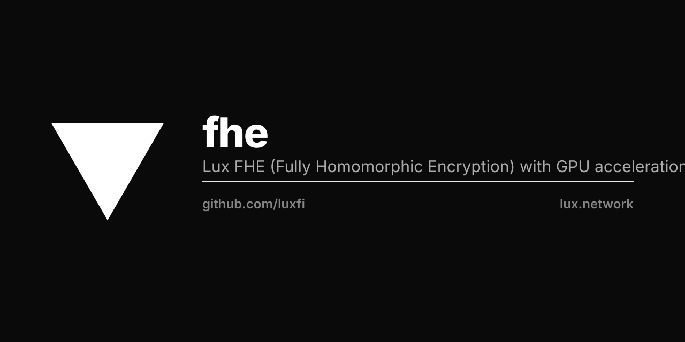

<p align="center"></p>

# Lux FHE

Fully homomorphic encryption library for computing on encrypted data -- original Go implementation built on lattice-based cryptography.

```
go get github.com/luxfi/fhe
```

## What This Is

A from-scratch TFHE (Threshold Fully Homomorphic Encryption) implementation in Go. Built directly on `luxfi/lattice` (RLWE, RGSW, blind rotation) with NTT SIMD acceleration written in Go. Native FHE — no external library dependency; the Lux stack is self-contained.

This library encrypts individual bits, bootstraps after every gate, and composes gates into arbitrary boolean circuits including full integer arithmetic. It supports encrypted integer types from 4-bit to 256-bit (including `euint160` for Ethereum addresses and `euint256` for uint256).

## Architecture

```
fhe.go              Parameters, key generation, bootstrap key construction
                    Standard parameter sets: PN10QP27, PN11QP54, PN9QP28_STD128, PN9QP27_STD128Q

encryptor.go        Bit and public-key encryption (LWE samples, Q/8 encoding)
decryptor.go        Bit decryption (threshold extraction from LWE)

evaluator.go        Boolean gate evaluation on encrypted bits
                    Gates: AND, OR, XOR, NAND, NOR, XNOR, NOT
                    Multi-input: MAJORITY (2-of-3), CMPCOMBINE (comparison cascade)
                    Each gate = blind rotation + sample extraction + key switching

integers.go         Radix ciphertext (encrypted integers via bit decomposition)
integer_ops.go      Add, Sub, Mul, Neg, comparison (Lt, Gt, Eq, Lte, Gte, Min, Max)
bitwise_integers.go AND, OR, XOR, NOT, shifts on encrypted integers
shortint.go         Short integer operations (4-bit, 8-bit)
lazy_carry.go       Lazy carry propagation for chained arithmetic

ntt_simd.go         SIMD-optimized NTT engine
                    Barrett reduction, Montgomery multiplication
                    Precomputed twiddle factors in bit-reversed order
                    Parallel butterfly operations

serialization.go    Ciphertext serialization/deserialization
security.go         Security level estimation
profile.go          Performance profiling hooks
random.go           Cryptographic randomness
threshold_rng.go    Threshold random number generation on encrypted data
```

### How It Works

1. **Encryption**: A plaintext bit is encoded as an LWE sample with noise: `(a, b = <a,s> + m*Q/8 + e)`. The `Q/8` encoding places TRUE at `+Q/8` and FALSE at `-Q/8`.

2. **Gate evaluation**: Two encrypted bits are added (producing a noisy result in `[-Q/4, Q/4]`), then a programmable blind rotation maps the result through a test polynomial that encodes the gate's truth table.

3. **Bootstrapping**: Every gate evaluation includes a full bootstrap (blind rotation + sample extraction + key switching), refreshing noise so gates can be composed indefinitely.

4. **Integer arithmetic**: Integers are radix-decomposed into encrypted bits. Addition uses a ripple-carry adder with lazy carry propagation. Multiplication uses shift-and-add. Comparison uses a cascaded bit-by-bit approach with the CMPCOMBINE gate.

### Parameter Sets

| Parameter Set | N | Q | Security | Use Case |
|--------------|---|---|----------|----------|
| `PN10QP27` | 1024 | ~134M | 128-bit classical | General purpose |
| `PN11QP54` | 2048 | ~2^54 | 128-bit classical | Higher precision |
| `PN9QP28_STD128` | 512/1024 | ~2^28 | 128-bit classical | OpenFHE-comparable |
| `PN9QP27_STD128Q` | 512/1024 | ~2^27 | 128-bit post-quantum | PQ security margin |

### Encrypted Integer Types

| Type | Bits | Use |
|------|------|-----|
| `FheBool` | 1 | Encrypted boolean |
| `FheUint4` | 4 | Short integer, nibble operations |
| `FheUint8` | 8 | Byte-level encrypted data |
| `FheUint16` | 16 | Short integers |
| `FheUint32` | 32 | Standard integers |
| `FheUint64` | 64 | Balances, timestamps |
| `FheUint128` | 128 | Large integers |
| `FheUint160` | 160 | Ethereum addresses |
| `FheUint256` | 256 | EVM uint256 |

## FFI Bindings

### C Shared Library

```bash
CGO_ENABLED=1 go build -buildmode=c-shared -o dist/libluxfhe.so ./bindings/cabi/
```

Produces `libluxfhe.{so,dylib,dll}` + `libluxfhe.h`. All Go objects are managed behind opaque `uint64` handles. Callable from Python (ctypes/cffi), TypeScript (N-API), or any C-compatible FFI.

### Rust

```bash
cd bindings/rust
cargo build --release
```

Rust bindings link against the C shared library via `build.rs`.

## Usage

```go
import "github.com/luxfi/fhe"

// Setup
params, _ := fhe.NewParametersFromLiteral(fhe.PN10QP27)
kg := fhe.NewKeyGenerator(params)
sk, pk := kg.GenKeyPair()
bsk := kg.GenBootstrapKey(sk)

// Encrypt bits
enc := fhe.NewEncryptor(params, sk)
ct1, _ := enc.EncryptBit(true)
ct2, _ := enc.EncryptBit(false)

// Evaluate gates (no secret key needed)
eval := fhe.NewEvaluator(params, bsk)
ctAnd, _ := eval.AND(ct1, ct2)   // encrypted false
ctOr, _ := eval.OR(ct1, ct2)     // encrypted true
ctXor, _ := eval.XOR(ct1, ct2)   // encrypted true

// Decrypt
dec := fhe.NewDecryptor(params, sk)
result := dec.DecryptBit(ctAnd)   // false
```

### Integer Arithmetic

```go
intParams, _ := fhe.NewIntegerParams(params, 2) // 2-bit message space per block
intEnc := fhe.NewIntegerEncryptor(intParams, sk)

a, _ := intEnc.EncryptUint64(42, fhe.FheUint64)
b, _ := intEnc.EncryptUint64(10, fhe.FheUint64)

intEval := fhe.NewIntegerEvaluator(intParams, bsk)
sum, _ := intEval.Add(a, b)    // encrypted 52
lt, _ := intEval.Lt(a, b)      // encrypted false (42 < 10)

intDec := fhe.NewIntegerDecryptor(intParams, sk)
val := intDec.Decrypt64(sum)   // 52
```

## Precompiled Binaries

Application-specific encrypted computation demos:

| Binary | Description |
|--------|-------------|
| `auction` | Sealed-bid auction on encrypted bids |
| `compliance` | Encrypted compliance threshold checking |
| `darkpool` | Dark pool order matching on encrypted orders |
| `marketmaker` | Market making with encrypted spreads |
| `mediaseal` | Media provenance with encrypted metadata |
| `vote` / `voting` | Encrypted ballot tallying |
| `seal` | Generic encrypt/decrypt CLI |
| `proof` | Zero-knowledge proof of encrypted computation |
| `stats` | Statistical operations on encrypted data |

## Testing

```bash
go test ./...
```

## Papers

- [Lux TFHE](https://github.com/luxfi/papers/blob/main/lux-tfhe.pdf) -- TFHE construction and parameter analysis
- [Lux FHE Smart Contracts](https://github.com/luxfi/papers/blob/main/lux-fhe-smart-contracts.pdf) -- encrypted EVM execution
- [Lux FHE Benchmarks](https://github.com/luxfi/papers/blob/main/lux-fhe-benchmarks.pdf) -- gate timing on Apple M2 / EPYC / H100
- [Lux FHE API](https://github.com/luxfi/papers/blob/main/lux-fhe-api.pdf) -- precompile interface specification
- [Lux FHE MPC Hybrid](https://github.com/luxfi/papers/blob/main/lux-fhe-mpc-hybrid.pdf) -- threshold decryption via MPC
- [Lux NTT Transform](https://github.com/luxfi/papers/blob/main/lux-ntt-transform.pdf) -- SIMD NTT optimization

## Dependencies

- [`luxfi/lattice`](https://github.com/luxfi/lattice) -- RLWE, RGSW, ring operations, blind rotation (the actual lattice math)

Self-contained — `luxfi/lattice` is the only external dependency, and it lives in the same ecosystem.

## License

Lux Ecosystem License v1.2. See [LICENSE](LICENSE).
